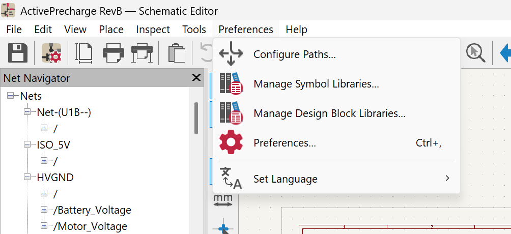
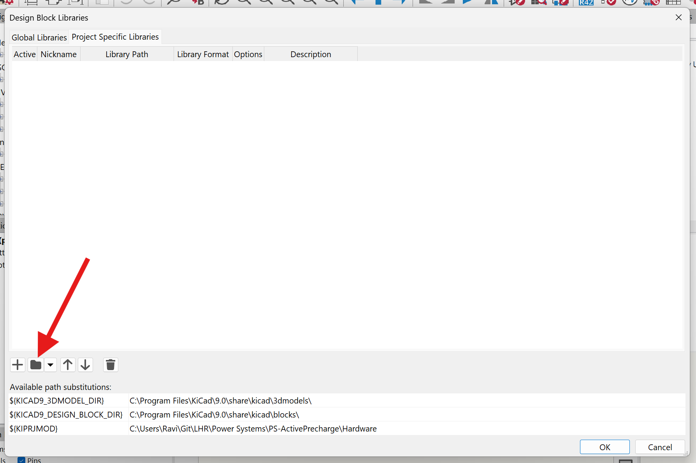
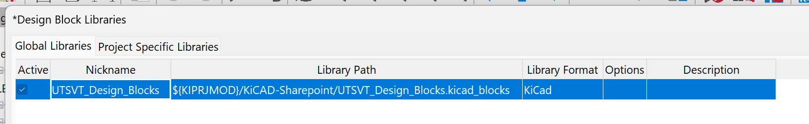
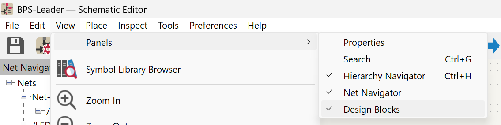
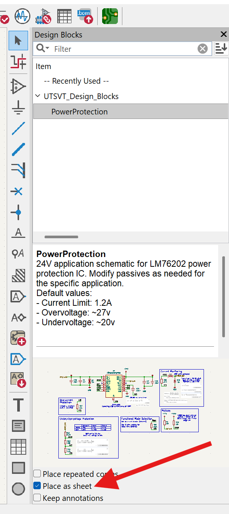
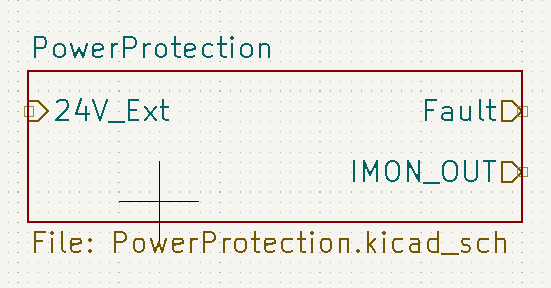
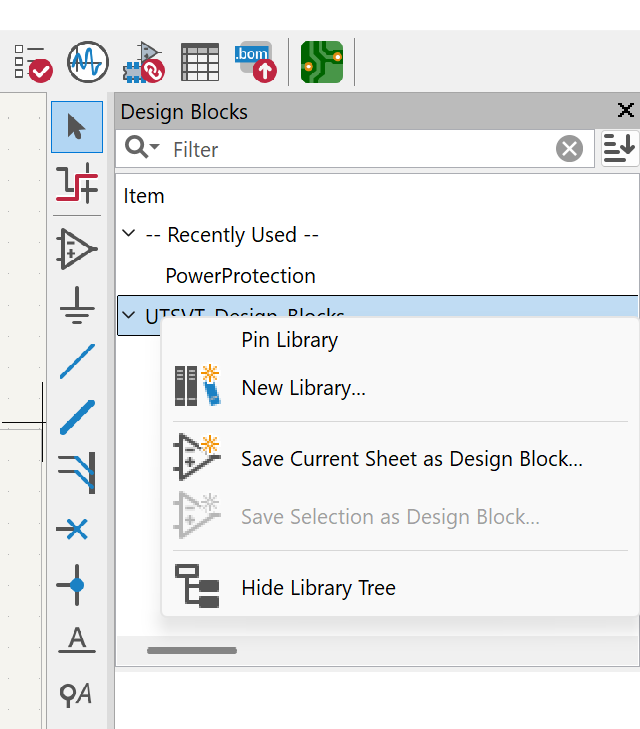
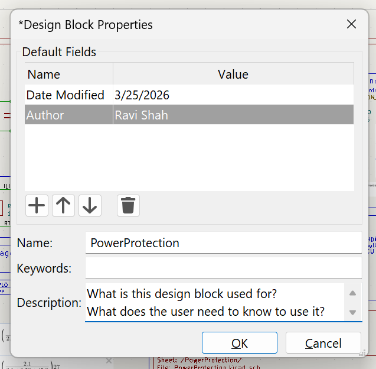
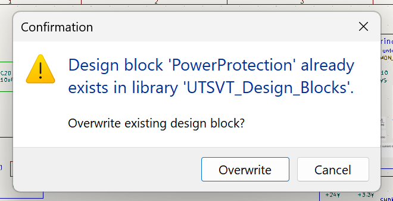

## What's a Design Block?
Design Blocks are a KiCAD feature that allows you to create easily replicable schematics that stay updated across several projects. These can be imported into your project schematics as hierarchical subsheets, so you can interact with them without modifying the underlying block. LHRs uses design blocks to share common circuitry, such as MCU, power distribution, USB, etc.

## Adding the LHRs Design Block Library
For each project, you'll have to add the design block library just like you add the symbol and footprint libraries. To add the LHRs design blocks, follow these steps:

First, open your project schematic and navigate to Preferences -> Manage Design Block Libraries.

Then, switch to Project Specific Libraries at the top and click the folder icon. Navigate to the KiCAD-Sharepoint folder in your project and select the folder called "UTSVT_Design_Blocks.kicad_blocks"

This is what the library will look like once added. Make sure it's using "${KIPRJMOD}" instead of an absolute directory so your libraries load on other computers. Finally, click OK to confirm adding the library.

To see the design blocks available in our library, navigate to View -> Panels -> Design Blocks.

You'll now see this panel on the right side of the schematic editor. Each design block will be listed under our library. Select a design block to see more information, including a brief description, usage instructions, and a preview of the schematic. Make sure the checkbox for "Place as sheet" is checked so the block inserts as a new subsheet instead of directly into your main sheet.

Finally, double click the name of the design block and drag to create the hierarchical sheet. Then, right click on the new subsheet and click "Place Sheet Pins" to place each hierarchical pin. Now you can double click on the subsheet and see what's inside the design block :P

## Creating a New Design Block
To add a new design block to the LHRs library, follow these steps:

First, create the schematic you want to save as a design block. Make sure to follow all design standards and ensure all components have correct datasheets, footprints, and 3D models linked. Then, right click on the LHRs design block library and select "Save Current Sheet as Design Block..."

In the popup window, add fields for Date Modified and Author, along with a name and description as shown. Click OK to save.

To modify an existing block, simply save the current sheet with the same name as the existing one and click Overwrite.

