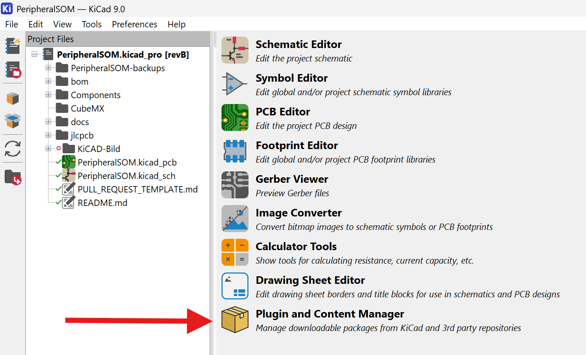
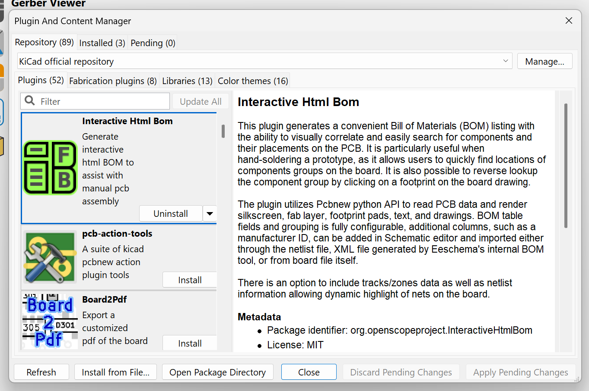
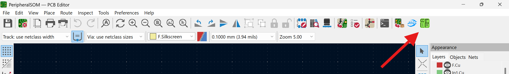
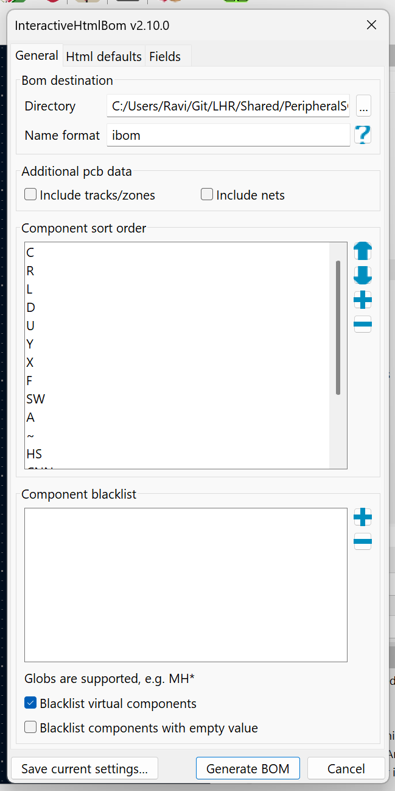

## KiCad Installation
For the 2025-2026 design cycle, LHRs Electrical members will use KiCad 9. Download the latest stable version [here](https://www.kicad.org/download/). 
## Required Plugins
There are a few plugins we use that aid in day-to-day development and will make your life a lot easier. You can access the Plugin and Content Manager (PCM) from the KiCad home screen as shown below.

### Interactive HTML BOM (IBOM)
This allows you to generate a convenient Bill of Materials (BOM) listing with the ability to visually correlate and easily search for components and their placements on the PCB. It's useful when hand-soldering boards, since you can quickly find the location of each component you're placing. Install from the PCM as shown below. Make sure to click "Apply Pending Changes."

Once installed, you can launch the IBOM tool from pcbnew by clicking this icon in the top bar.

Then modify any relevant settings and generate the IBOM. By default, it will be saved in your project directory as `ibom.html`

### KiCAD JLCPCB Tools
