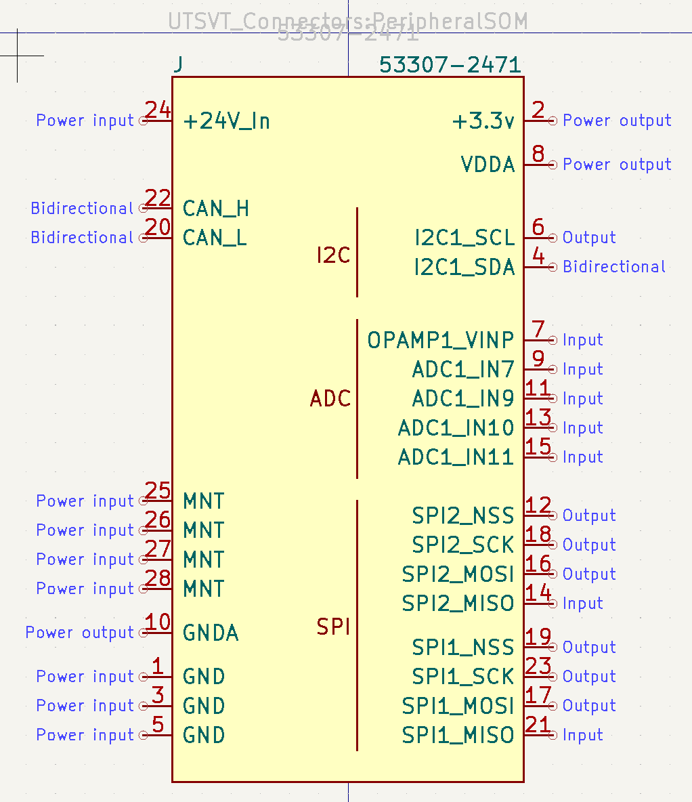

To ensure consistency throughout the team's hardware, there are a few standards to follow when contributing to the shared libraries and working on your design projects.
## Naming Convention
All Github repositories for PCBs should be named as follows: `{System}-{BoardName}PCB`. Some examples would be:

- `PS-ThermistorCollectorPCB`
- `PS-PowerDistributionUnitPCB`
- `Controls-DashboardPCB`
## Symbols
All symbols must have the following fields populated to be merged into our shared libraries or used in an LHRs schematic.

| Field | Purpose |
|---|---|
| Reference | [Type of component](https://en.wikipedia.org/wiki/Reference_designator#Designators) |
| Value | Component value (resistance, capacitance, etc.) |
| Footprint | Footprint library & name (should be linked) |
| Datasheet | Link to the manufacturer's datasheet |
| Description | Summary of the component's functionality |
| P/N | Manufacturer's part number |

Example symbol fields would look something like this:

Additionally, symbol pins should be grouped intuitively as shown and assigned the proper functionality (power, input, output, etc.). Please double check that the pins & pin numbers actually match the package shown on the datasheet.

## Footprints
## Schematics
## Layout
## Routing
