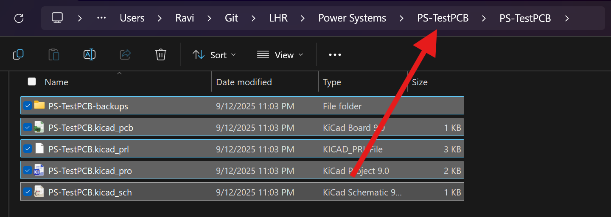
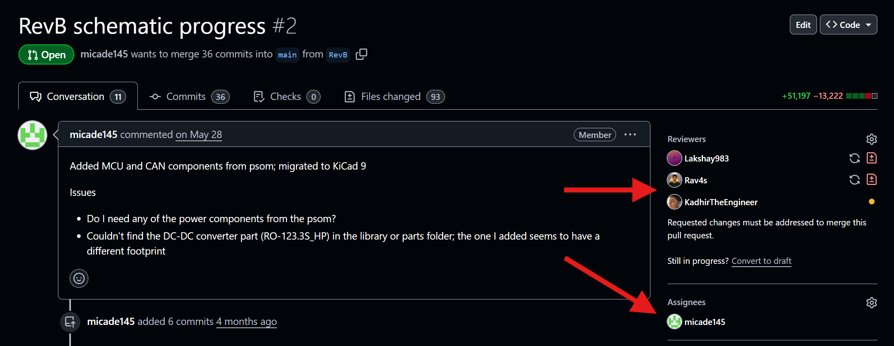

## Overview
We follow this workflow when designing PCBs for the car. Sticking to this will help you develop hardware smoothly while learning a lot in the process.
## Timeline
Each step of the PCB design process should take approximately this much time (including reviews). Your timeline may vary based on board complexity and overall deadlines, and you'll get faster at iterating as you learn more, but try not to deviate too much from this.

- Requirements & Setup - 1 day
- Schematic & Part Selection - 1-2 weeks
- Layout & Routing - 2 weeks
- Production Files & Documentation - 1 day

The goal of this timeline is to ensure you have some kind of reviewable progress weekly. If you're blocked by another system/dependency, make sure they're aware so you can continue working. Don't be afraid to ask for reviews/help often to stay on track, that's what we're here for :P
## Project Setup
Follow these steps to set up a new hardware project.
### Github Repo Setup
First, ask your lead to create a Github repository to store all your project files. If they don't follow the [naming convention](https://lhr-solar.github.io/KiCAD-Sharepoint/Standards/#naming-convention), they have to pay for your food next workday. Clone the repository **using SSH** and add our [pull request (PR) template](https://github.com/lhr-solar/KiCAD-Sharepoint/blob/main/PULL_REQUEST_TEMPLATE.md) to the main directory. Also add a file called `.gitignore` with [these contents](https://github.com/lhr-solar/PS-LVCarrierPCB/blob/main/.gitignore) so git knows to ignore backup/temporary files. Open your terminal and use git to add, commit, and push these files to main. Now, whenever you create a PR, the template checklist will show up for you to fill out. Finally create and switch to a branch called "RevA" using the command `git switch -c RevA`. You'll do all your work for the first revision of your board on this branch.
### Shared Libraries
We share several parts between our team's PCBs, including ICs, diodes, and more. This saves us from having to duplicate common symbols and footprints across projects, allowing for a single source of truth. These shared libraries can be found in [KiCAD-Sharepoint](https://github.com/lhr-solar/KiCAD-Sharepoint).

To add the shared libraries to your project, open your repository in the terminal and type `git submodule add git@github.com:lhr-solar/KiCAD-Sharepoint.git`. In the next step, you'll find out how to associate these with your KiCad project.

Note: if you're cloning a repository that already has KiCAD-Sharepoint added, you need to run `git submodule update --init --recursive` to pull the shared libraries.
### Creating a KiCad Project
Now open KiCad and create a new project (Ctrl-N). Choose your repository folder and name the KiCad project the same as your repository name. **Important**: KiCad puts all your files inside another folder, so close KiCad and move these files into the main directory as shown. Finally, delete the folder KiCad created. 

### Documentation

## Schematic
TODO
## Part Selection
Do this before selecting footprints
Select footprints
TODO
## Layout & Routing
Put stuff on board
Edge cuts
Mounting
Planes/Stackup
TODO
## Review Process
PCB reviews are handled through Github pull requests. To create a PR, follow [these steps](https://docs.github.com/en/pull-requests/collaborating-with-pull-requests/proposing-changes-to-your-work-with-pull-requests/creating-a-pull-request). The PR template should automatically show up, with a checklist to fill out to make sure your PCB is up to standards. Assign reviewers using the sidebar as shown - make sure to assign at least 2 or 3 reviewers (usually your lead/sublead but can be any experienced member). Also ensure you're listed as the assignee for the PR.

Now copy the Github link to your PR and send it in the `#review-request` channel on Slack. Mention the reviewers you requested, and feel free to bug them if they don't respond/review in the next couple of days. To keep the review process quick, you should aim to respond to review comments as fast as possible, but make sure you understand what the reviewers are saying. If you're confused about a concept or technical detail, don't hesitate to ask (as a Github reply). It's always better to ask than to take feedback blindly :)
## Generating Production Files
When your schematic and layout have been approved, there's one last step before ordering it - generating production files. These files tell the fabrication house how to actually cut the board edges, drill vias, and deposit copper onto the board. To generate production files for JLC (Gerbers, BOM, and CPL), use the JLCPCB Tools plugin as described [here](../KiCad-Setup/#kicad-jlcpcb-tools).
## Ordering
Follow the [ordering instructions](../Ordering) to order your PCB prototype using JLCPCB. Usually we order in a couple of batches per revision cycle, so reach out to your lead to confirm your order timeline (you may need to speed up development to hit these dates).
